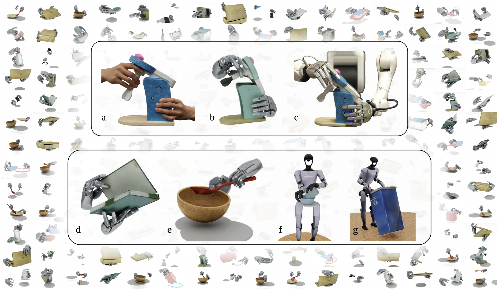
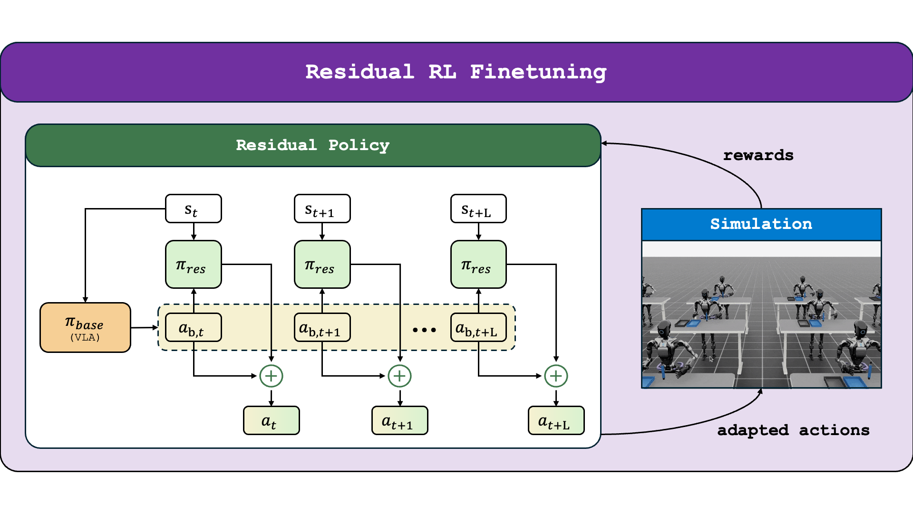
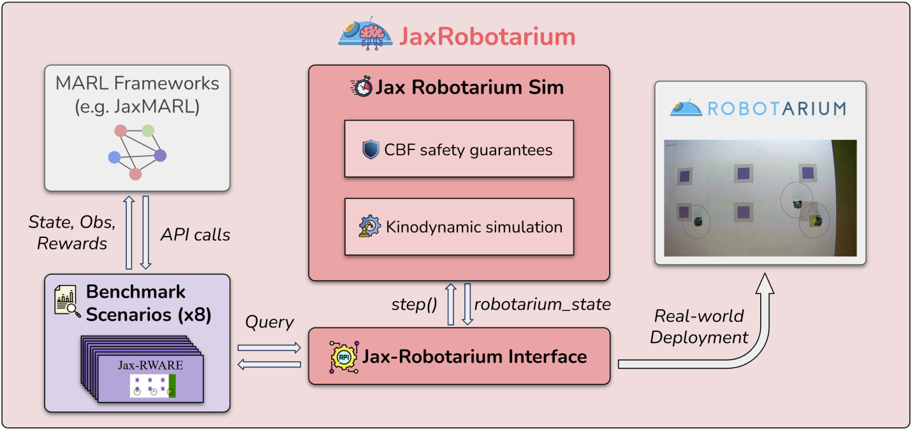
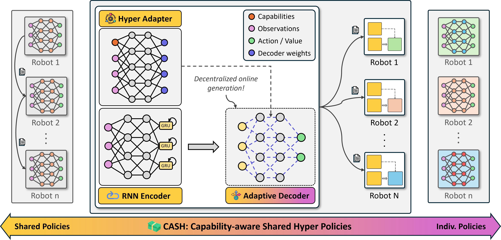
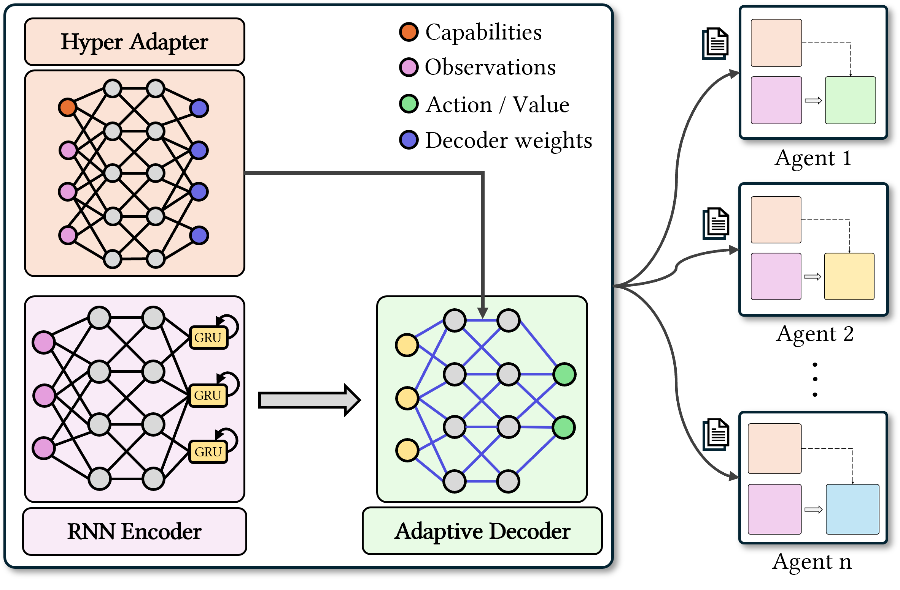
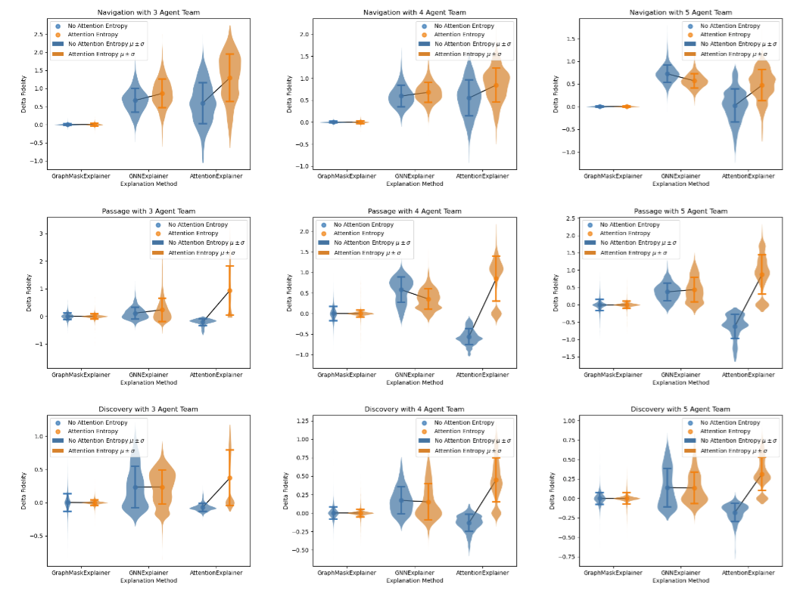

  

    

      I'm an Applied Researcher at NVIDIA working on dexeterous manipulation and humanoid loco-manipulation. Previously, I was a master's student in Computer Science at Georgia Institute of Technology advised by Harish Ravichandar working on learning based methods for multi-robot coordination.
    

    

      <a href="https://github.com/shalin-jain" class="contact-pill github">GitHub</a>
      <a href="https://scholar.google.com/citations?user=sLK5VCAAAAAJ&hl=en" class="contact-pill scholar">Scholar</a>
      <a href="https://www.linkedin.com/in/shalin-jain/" class="contact-pill linkedin">LinkedIn</a>
    

  

  

    
  

---

## Publications

    First Author
    * indicates equal contribution

  
  

    <h3>Learning Dexterous Manipulation Using Contact Wrench Guidance From Human Demonstration</h3>
    
Xinghao Zhu*, Zixi Liu*, <b>Shalin Jain*</b>, Chenran Li, Milad Noori, Huihua Zhao, John Welsh, Michael Andres Lin, Wei Liu, Tingwu Wang, Xingye Da, Zhengyi Luo, Vishal Kulkarni, Naema Bhatti, Yuke Zhu, Linxi Fan, Bowen Wen, Danfei Xu, Soha Pouya, Yan Chang

    Under Review
    

      <a href="https://nvidia-isaac.github.io/video_to_data/chord/" class="pub-pill project">Project</a>
      <a href="https://arxiv.org/abs/2607.00033" class="pub-pill arxiv">arXiv</a>
    

  

  
  

    <h3>Improving VLA Workspace Randomization Robustness for Industrial Pick-and-Place via Lightweight Residual RL: A Case Study</h3>
    
<b>Shalin Jain*</b>, Siva Kailas*, Harish Ravichandar

    CVPR 2026 EAI Workshop (Oral Highlight)
    

      <a href="https://star-lab.cc.gatech.edu/papers/Kailas-Jain-VLA-Robustness/" class="pub-pill project">Project</a>
      <a href="https://embodied-ai.org/cvpr2026/" class="pub-pill workshop">Workshop</a>
    

  

  
  

    <h3>JaxRobotarium: Training and Deploying Multi-Robot Policies in 10 Minutes</h3>
    
<b>Shalin Jain</b>, Jiazhen Liu, Siva Kailas, Harish Ravichandar

    CoRL 2025
    RSS 2025 MRS Workshop
    

      <a href="https://star-lab.cc.gatech.edu/papers/jain-jaxrobotarium/" class="pub-pill project">Project</a>
      <a href="https://mrs-workshop.github.io/rss25/" class="pub-pill workshop">Workshop</a>
      <a href="https://arxiv.org/abs/2505.06771" class="pub-pill arxiv">arXiv</a>
      <a href="https://github.com/GT-STAR-Lab/JaxRobotarium" class="pub-pill code">Code</a>
    

  

  
  

    <h3>CASH: Capability-Aware Shared Hypernetworks for Flexible Heterogeneous Multi-Robot Coordination</h3>
    
<b>Shalin Jain*</b>, Kevin Fu*, Pierce Howell, Harish Ravichandar

    CoRL 2025
    

      <a href="https://star-lab.cc.gatech.edu/papers/fu-jain-CASH-CoRL/" class="pub-pill project">Project</a>
      <a href="https://arxiv.org/abs/2501.06058" class="pub-pill arxiv">arXiv</a>
    

  

<!-- 

  
  

    <h3>Learning Flexible Heterogeneous Coordination with Capability-Aware Shared Hypernetworks</h3>
    
Kevin Fu, <b>Shalin Jain*</b>, Pierce Howell*, Harish Ravichandar

    AAMAS 2025
    

      <a href="https://star-lab.cc.gatech.edu/papers/Fu-CASH/" class="pub-pill project">Project</a>
      <a href="https://arxiv.org/abs/2501.06058v2" class="pub-pill arxiv">arXiv</a>
      <a href="https://github.com/GT-STAR-Lab/CASH" class="pub-pill code">Code</a>
    

  

 -->

  
  

    <h3>Evaluating and Improving Graph-based Explanation Methods for Multi-Agent Coordination</h3>
    
Siva Kailas, <b>Shalin Jain</b>, Harish Ravichandar

    AAMAS 2025
    

      <a href="https://star-lab.cc.gatech.edu/papers/Kailas-XMAS/" class="pub-pill project">Project</a>
      <a href="https://arxiv.org/abs/2502.09889" class="pub-pill arxiv">arXiv</a>
    

  

---

## Experience

- **NVIDIA - Applied Researcher** (Dec 2025 - Present)
  Dexterous manipulation and humanoid loco-manipulation.

- **NVIDIA - Robotics Engineering Intern** (May 2025 - Aug 2025)
  Improving and evaluating humanoid whole body control.

- **NVIDIA - DRIVE AV Software Engineering Intern** (May 2024 - Aug 2024)
  Generalized autonomous driving simulation for different autonomous vehicle stack components.

- **Amazon Robotics - Software Engineering Intern** (May 2023 - Aug 2023)
  Coverage path planning for building high quality SLAM maps autonomously.

- **Amazon Robotics - Software Engineering Co-Op** (Jan 2022 - Jul 2022)
  Orchestrated simulation and robot fleet management for autonomous mobile robots in human environments.

---

## Teaching

- **Graduate Head TA**, CS 3630: Intro to Robotics and Perception (Spring 2025)
- **Undergraduate TA**, CS 3630: Intro to Robotics and Perception (Fall 2024)
- **Undergraduate TA**, CS 3630: Intro to Robotics and Perception (Spring 2024)
- **Undergraduate TA**, CS 3630: Intro to Robotics and Perception (Fall 2023)

---

## Volunteering

- Reviewer – CoRL 2025
