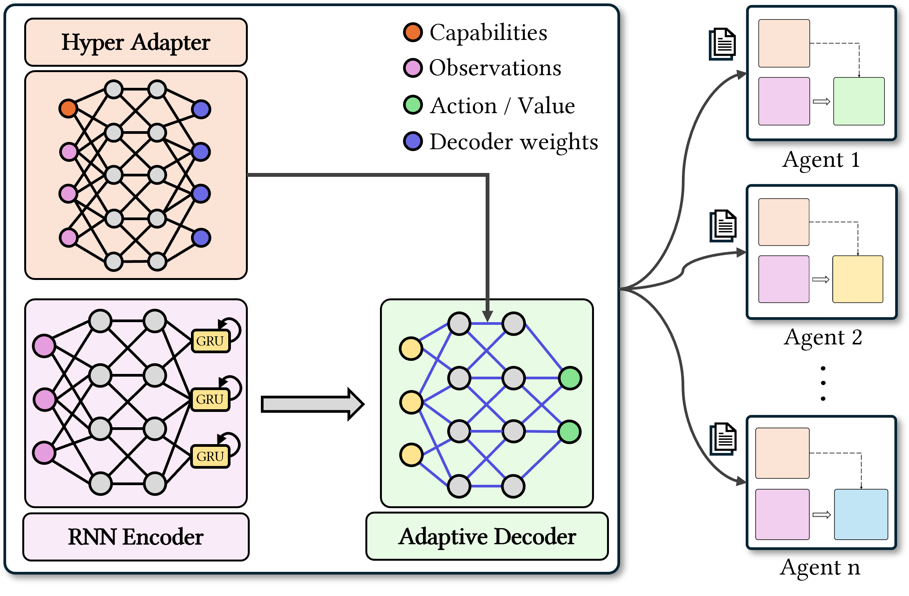
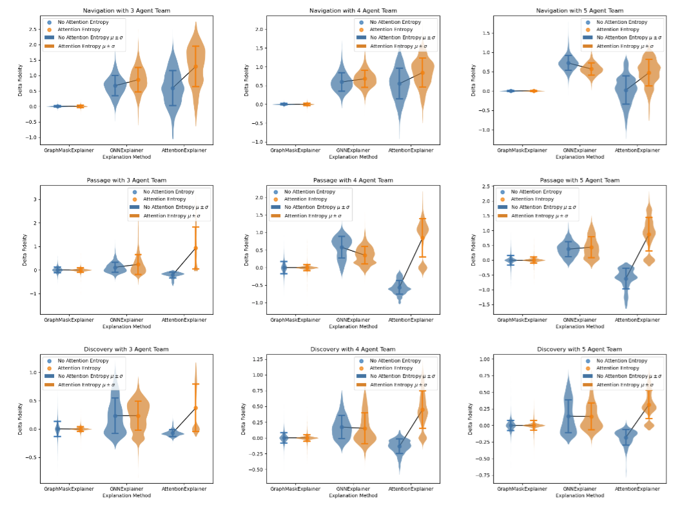

  

    

      I'm a master's student in Computer Science at Georgia Institute of Technology. I am interested in methods for enabling embodied physical systems in the real world that exhibit coordinated, adaptable, and collaborative behavior. To this end, my current research centers around reinforcement learning and multi-robot systems.
    

    

      💻 <a href="https://github.com/shalin-jain">GitHub</a>
      🔗 <a href="https://www.linkedin.com/in/shalin-jain/">LinkedIn</a>
      📄 <a href="assets/CV_ShalinJ.pdf">CV</a>
    

  

  

    
  

---

## Publications

  
  

    <h3>CASH: Capability-Aware Shared Hypernetworks for Flexible Heterogeneous Multi-Robot Coordination</h3>
    
<b>Shalin Jain*</b>, Kevin Fu*, Pierce Howell, Harish Ravichandar

    preprint
    

      📄 <a href="https://arxiv.org/abs/2501.06058">paper</a>
    

  

  
  

    <h3>JaxRobotarium: Training and Deploying Multi-Robot Policies in 10 Minutes</h3>
    
<b>Shalin Jain</b>, Jiazhen Liu, Siva Kailas, Harish Ravichandar

    RSS 2025 MRS Workshop
    

      🌐 <a href="https://star-lab.cc.gatech.edu/papers/jain-jaxrobotarium/">project page</a>
      🌐 <a href="https://mrs-workshop.github.io/rss25/">workshop page</a>
      📄 <a href="https://arxiv.org/abs/2505.06771">paper</a>
      💻  <a href="https://github.com/GT-STAR-Lab/JaxRobotarium">code</a>
    

  

  
  

    <h3>Learning Flexible Heterogeneous Coordination with Capability-Aware Shared Hypernetworks</h3>
    
Kevin Fu, <b>Shalin Jain*</b>, Pierce Howell*, Harish Ravichandar

    AAMAS 2025
    

      🌐 <a href="https://star-lab.cc.gatech.edu/papers/Fu-CASH/">project page</a>
      📄 <a href="https://arxiv.org/abs/2501.06058v2">paper</a>
      💻  <a href="https://github.com/GT-STAR-Lab/CASH">code</a>
    

  

  
  

    <h3>Evaluating and Improving Graph-based Explanation Methods for Multi-Agent Coordination</h3>
    
Siva Kailas, <b>Shalin Jain</b>, Harish Ravichandar

    AAMAS 2025
    

      🌐 <a href="https://star-lab.cc.gatech.edu/papers/Kailas-XMAS/">project page</a>
      📄 <a href="https://arxiv.org/abs/2502.09889">paper</a>
    

  

---

## Experience

- **NVIDIA - Robotics Engineering Intern** (May 2025 - Aug 2025)  
  Improving and evaluating humanoid whole body control.

- **NVIDIA - DRIVE AV Software Engineering Intern** (May 2024 - Aug 2024)  
  Generalized autonomous driving simulation for different autonomous vehicle stack components.

- **Amazon Robotics - Software Engineering Intern** (May 2023 - Aug 2023)  
  Coverage path planning for building high quality SLAM maps autonomously.

- **Amazon Robotics - Software Engineering Co-Op** (Jan 2022 - Jul 2022)  
  Orchestrated simulation and robot fleet management for autonomous mobile robots in human environments.

---

## Teaching

- **Graduate Head TA**, CS 3630: Intro to Robotics and Perception (Spring 2025)
- **Undergraduate TA**, CS 3630: Intro to Robotics and Perception (Fall 2024)
- **Undergraduate TA**, CS 3630: Intro to Robotics and Perception (Spring 2024)
- **Undergraduate TA**, CS 3630: Intro to Robotics and Perception (Fall 2023)

---

## Volunteering

- Reviewer – CoRL 2025
